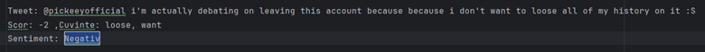

# Project Instructions🧪

## Table of Contents📚
1. [Overview](#overview)
2. [Exercise Details](#exercise-details)
   - [Sentiment Analysis](#sentiment-analysis)
   - [Most Frequent Words Analysis](#most-frequent-words-analysis)
     - [Approach 1 (Recommended)](#approach-1-recommended)
     - [Approach 2 (Alternative using NLTK)](#approach-2-alternative-using-nltk)
   - [Deriving Sentiment Scores for New Words](#deriving-sentiment-scores-for-new-words)
   - [Friends and Happiness Correlation](#friends-and-happiness-correlation)
   - [Detecting Manipulated Datasets](#detecting-manipulated-datasets)
---

## Overview📋

To execute the exercises, run `main.py` and select the desired exercise. It is recommended to follow the order of execution to avoid interferences since the exercises build on each other. For example: `ex1`, `ex2`, `ex3`, `ex4`, or `exit` if you want to exit the program.

The `main.py` file includes code to simplify the execution of the exercises. This is an interactive and straightforward way to run specific scripts using keyboard commands, with results written to `rezultat_exX.txt`, where `X` represents the exercise number. Additional comments are provided in the code for extra clarification if needed. The exercises are located in the `.venv` folder.

---

## Exercise Details📝

### Sentiment Analysis🧠

- **Goal**: For each tweet in `twitter_data1.txt`, calculate its score by checking the words in `sentiment_scores.txt`. The sentiment is determined as:
  - **Negative**: Score < 0
  - **Positive**: Score > 0
  - **Neutral**: Score = 0
- For validation, the script also identifies and outputs the words found in each tweet.

#### Examples:

- **Negative Sentiment**:

  
   
  <em>Example 1: Negative Sentiment</em>

  - Words from `sentiment_scores.txt`

  
   
  
   
  <em>Example 1: Words</em>

- **Positive Sentiment**:

  
   
  <em>Example 2: Positive Sentiment</em>

  - Words from `sentiment_scores.txt`

  
   
  <em>Example 2: Words</em>

- **Neutral Sentiment**:

  
   
  <em>Example 3: Neutral Sentiment</em>

---

### Most Frequent Words Analysis📈

- **Goal**: Extract the 500 most frequent words from all tweets that do not appear in `sentiment_scores.txt`. These words are ranked based on their occurrence frequency.

#### Approach 1 (Recommended):

Results are written to `rezultat_ex1.txt`.

  
   
  <em>Most Frequent Words List</em>

---

#### Approach 2 (Alternative using NLTK):

- **Library**: NLTK is used to process words.
- **Note**: The NLTK library needs to be downloaded.

---

### Deriving Sentiment Scores for New Words💡

- **Goal**: Using the results from `ex2.2`, compute sentiment scores for the identified words based on their context in tweets.

#### Algorithm:
1. For each word, calculate the sum of sentiment scores in tweets where it appears.
2. Divide the sum by the number of positive and negative tweets.

**Note**: Neutral tweets (score = 0) are excluded.

---

### Friends and Happiness Correlation📊

- **Goal**: Analyze the number of friends of each user and correlate it with the sentiment expressed in their tweets.

#### Method:
1. **Library**: `matplotlib` is used for plotting a graph.
2. Tweets are sorted by the number of friends, with positive and negative sentiments highlighted.

#### Result:
- Users with more friends tend to post tweets with more positive sentiment.
- **Hypothesis**: Users with a larger friend network may be more mindful of their posts and their impact on their audience.

  
   
  <em>Graph</em>

---

### Detecting Manipulated Datasets🕵️‍♂️

1. **Metadata Analysis**:
   - Examine metadata for signs of manipulation or inconsistencies.
2. **Comparison with Similar Datasets**:
   - Compare the dataset with others to identify significant discrepancies.
3. **Probability Distribution Analysis**:
   - Analyze the dataset's probability distribution against theoretical expectations.

---
